Absolutely — below is a **complete flowchart-style view** of the major flows in a **URL shortener system**.

I’ll give you:

1. a **master flow map**
2. separate flowcharts for each important flow
3. a quick note on how to read them

You can copy this directly into Markdown that supports **Mermaid**.

---

# 1. Master flow diagram

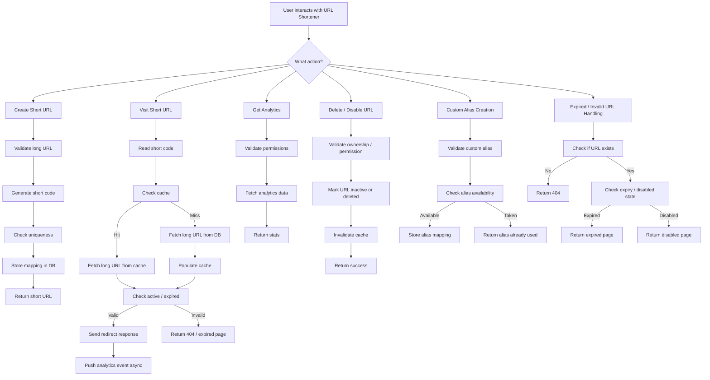

---

# 2. Create Short URL flow

This is the **write path**.

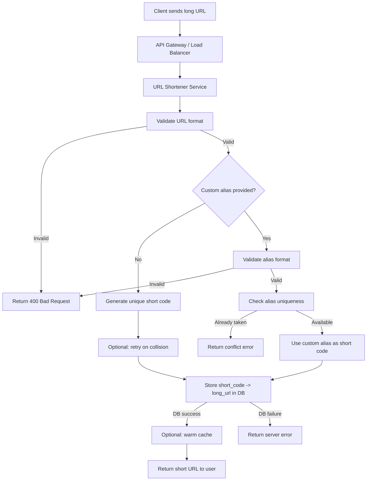

---

# 3. Visit Short URL flow

This is the **read path** and the most important one.

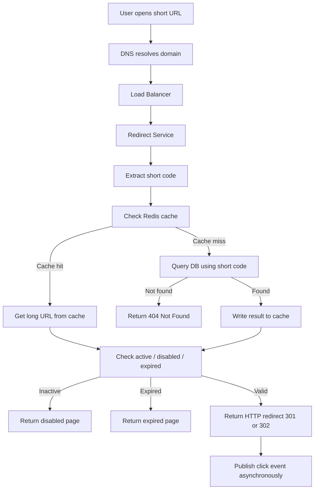

---

# 4. Redirect flow with cache hit / miss decision

This is the small but critical runtime path.

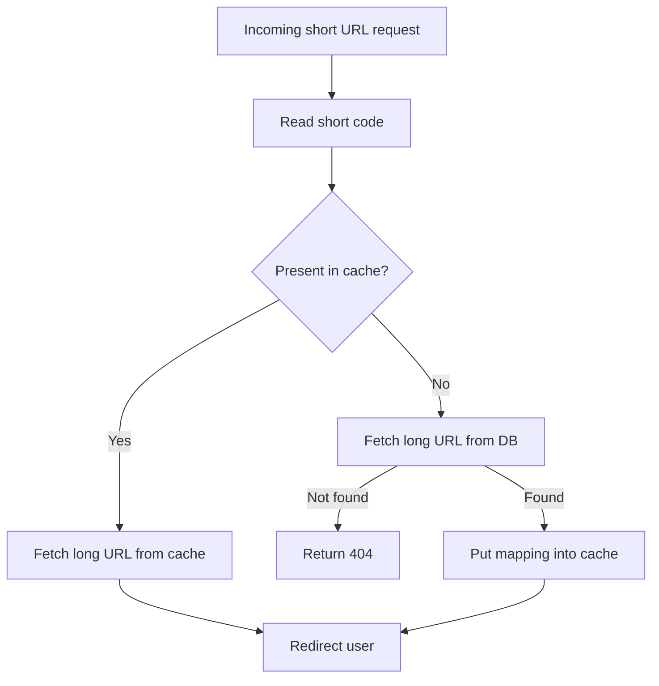

---

# 5. Short code generation flow

This is the core logic for uniqueness.

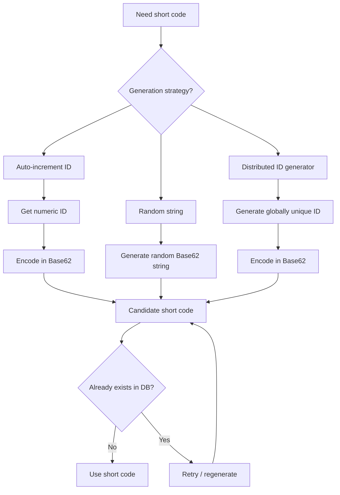

---

# 6. Custom alias creation flow

Useful if the user wants something like `short.ly/rohit`.

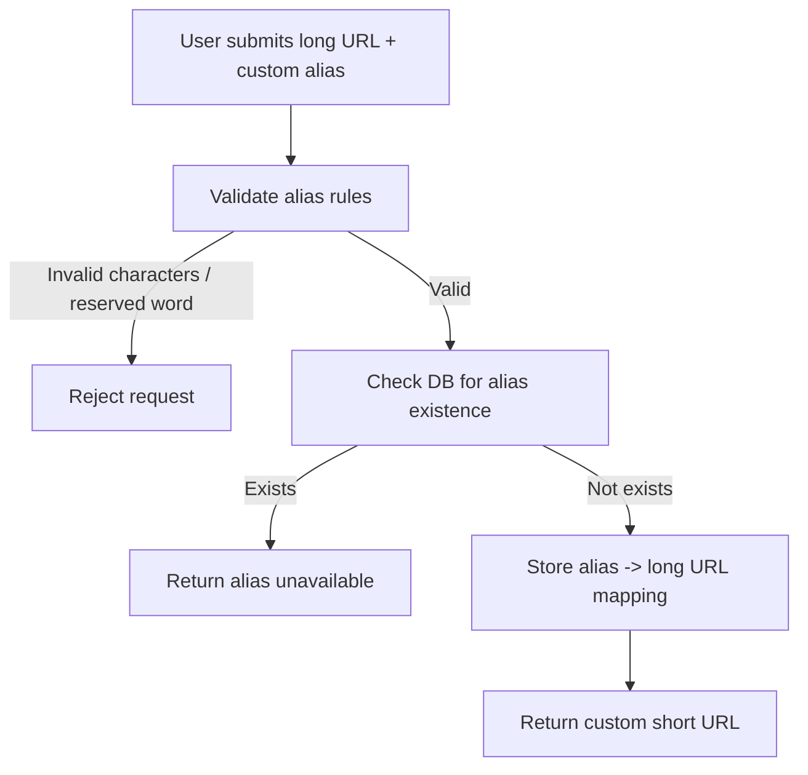

---

# 7. Expired / disabled / invalid URL flow

This handles edge cases cleanly.

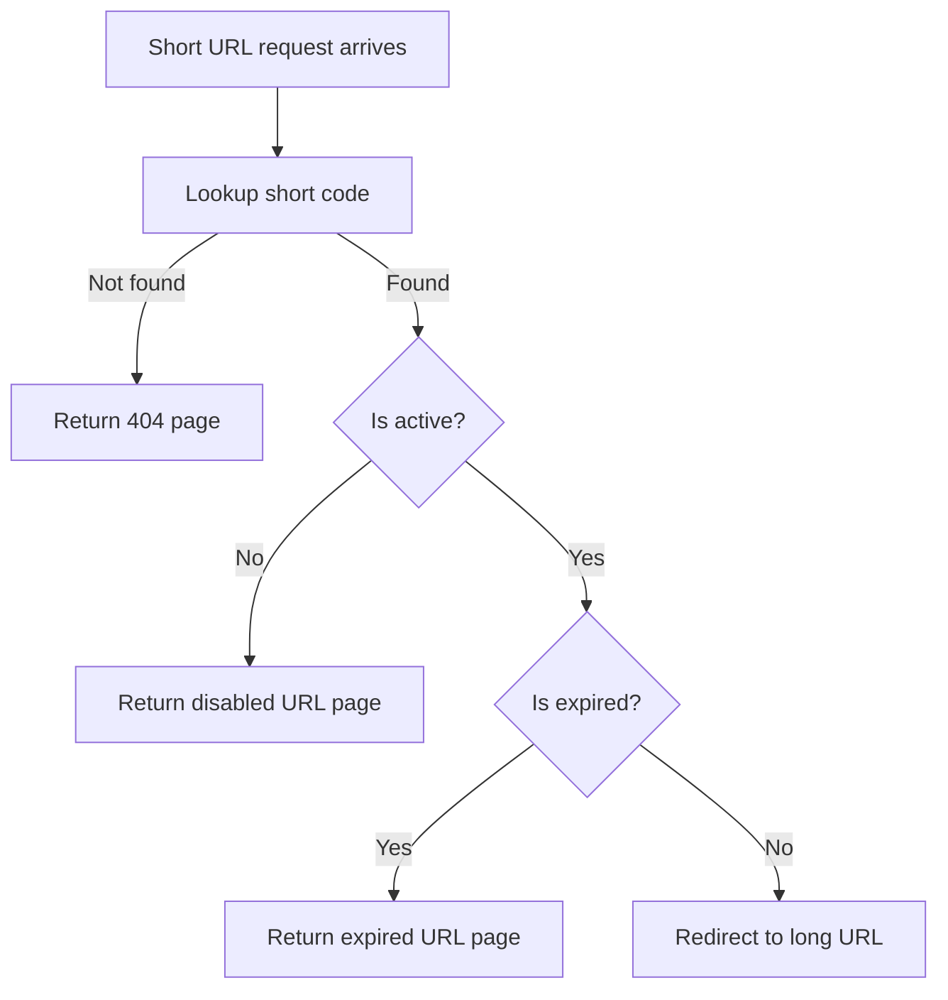

---

# 8. Analytics tracking flow

Best practice is to keep analytics **asynchronous** so redirects stay fast.

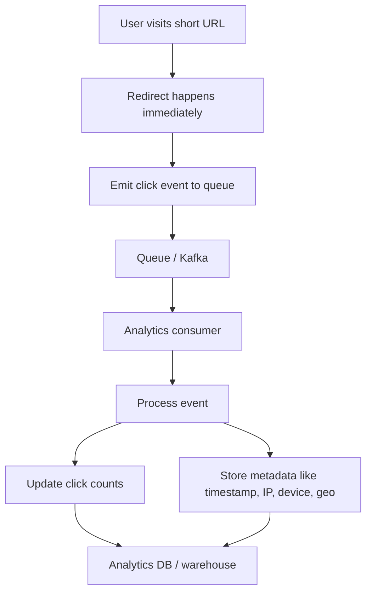

---

# 9. Analytics retrieval flow

For dashboard or stats page.

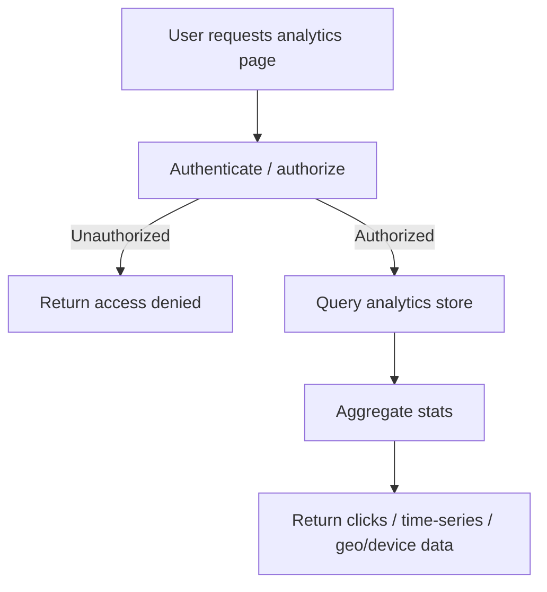

---

# 10. Delete / disable short URL flow

Usually systems prefer **soft delete** over hard delete.

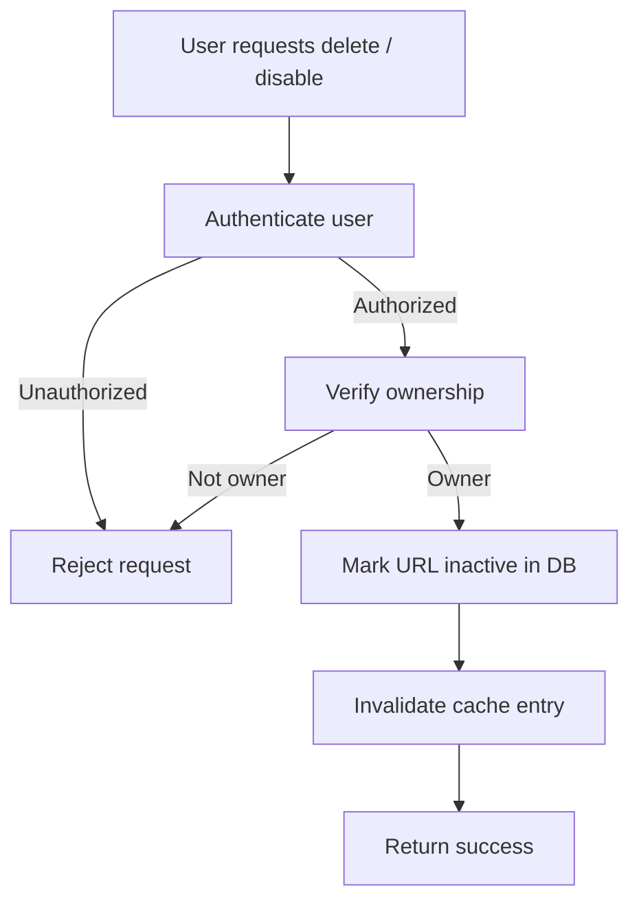

---

# 11. Admin abuse / malicious URL blocking flow

This is important in production systems.

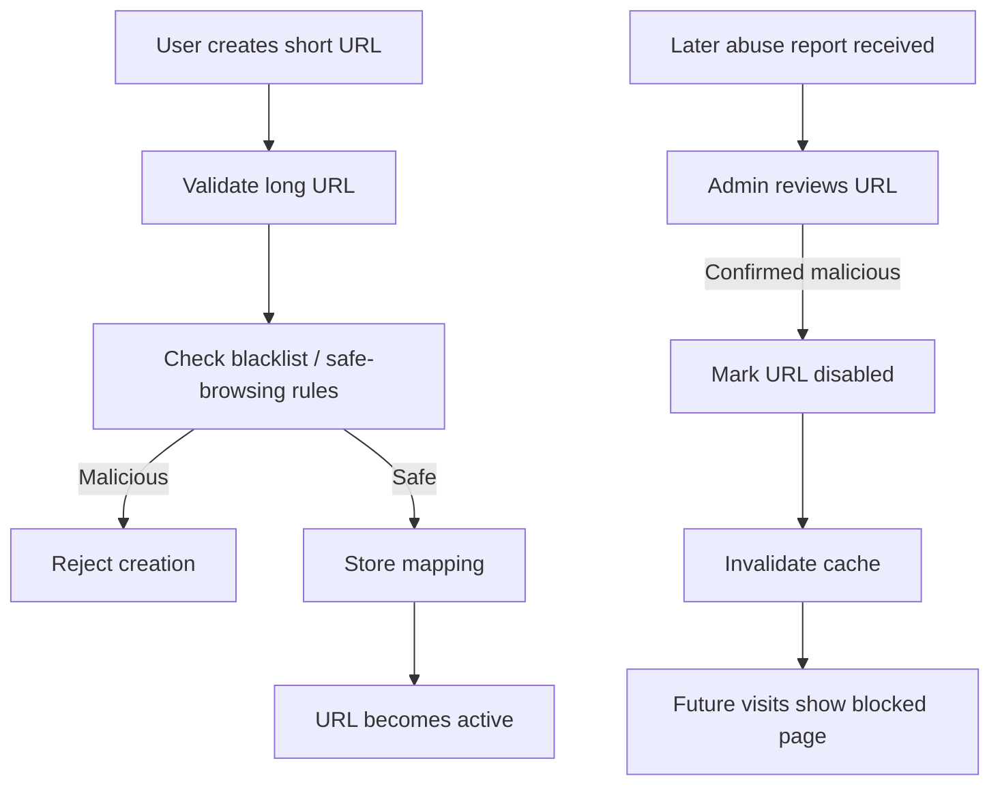

---

# 12. End-to-end system flow

This is the best “interview whiteboard” version.

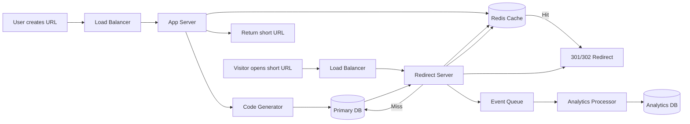

---

# 13. How to think about the flows conceptually

You can mentally group the system into **4 major paths**:

### A. Write path

* create short URL
* validate
* generate code
* store in DB

### B. Read path

* visit short URL
* cache lookup
* DB fallback
* redirect

### C. Control path

* custom alias
* delete/disable
* expiry handling
* permissions

### D. Async path

* analytics
* abuse detection
* background processing

---

# 14. Best interview order to explain these flows

When someone asks “Design a URL shortener”, explain in this order:

1. **Create URL flow**
2. **Visit URL flow**
3. **Short code generation flow**
4. **Cache hit/miss flow**
5. **Expiry / invalid URL flow**
6. **Analytics async flow**
7. **Delete / disable flow**
8. **Scaling and bottlenecks**

That sequence sounds structured and strong.

---

# 15. Super-short textual flow map

This is useful for revision:

```text
CREATE FLOW
User -> API -> Validate URL -> Generate code -> Check uniqueness -> Store in DB -> Return short URL

VISIT FLOW
User -> Load Balancer -> App -> Cache?
  -> Hit -> Redirect
  -> Miss -> DB -> Cache -> Redirect

VALIDATION FLOW
Short code -> Exists?
  -> No -> 404
  -> Yes -> Active?
      -> No -> Disabled
      -> Yes -> Expired?
          -> Yes -> Expired page
          -> No -> Redirect

ANALYTICS FLOW
Redirect -> Publish event -> Queue -> Consumer -> Analytics DB

DELETE FLOW
User -> Auth -> Verify ownership -> Mark inactive -> Invalidate cache -> Success
```

---

# 16. The one diagram I’d recommend you memorize

If you only want **one** diagram for interviews, memorize this:

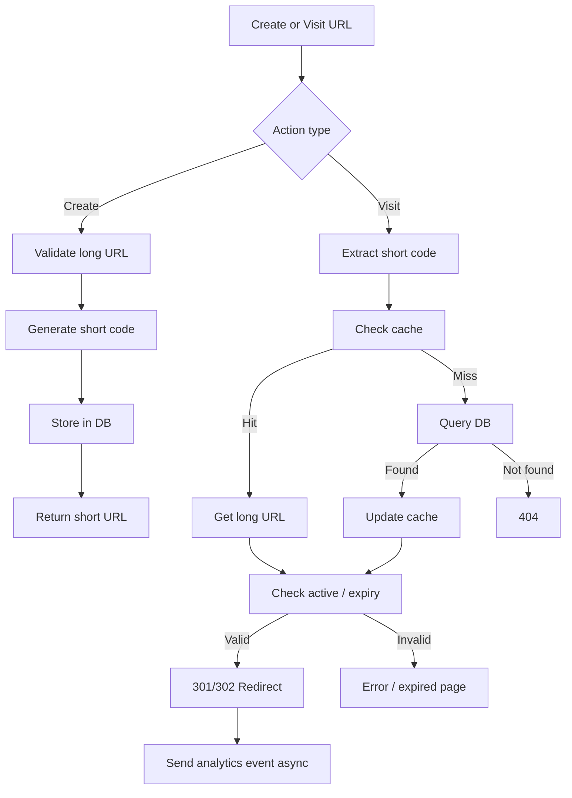

---

I can also turn this into a **clean interview-ready mind map** or a **beautiful architecture diagram image**.
